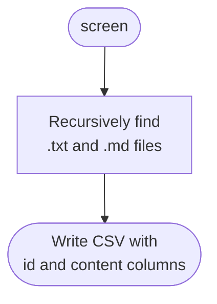
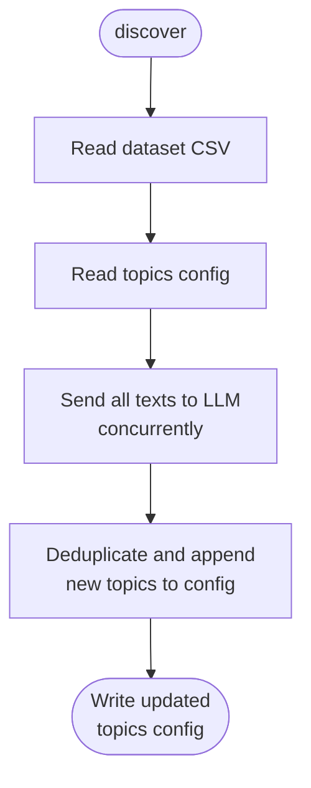
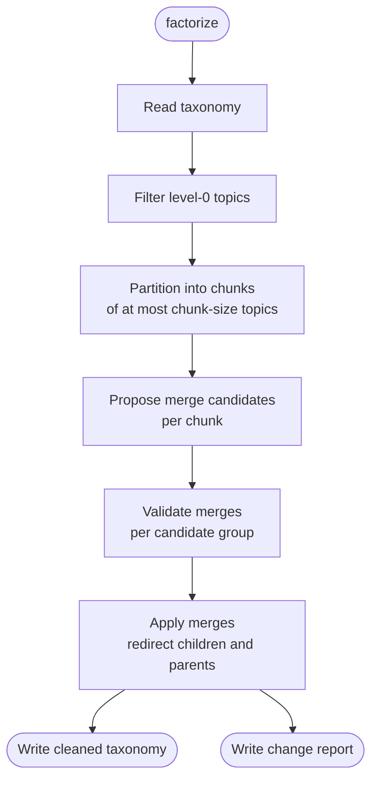
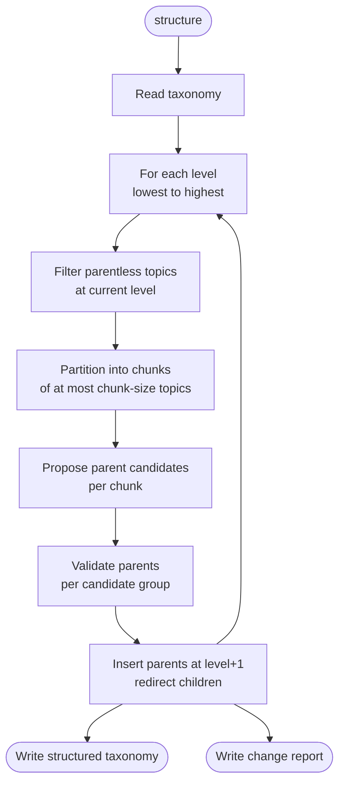
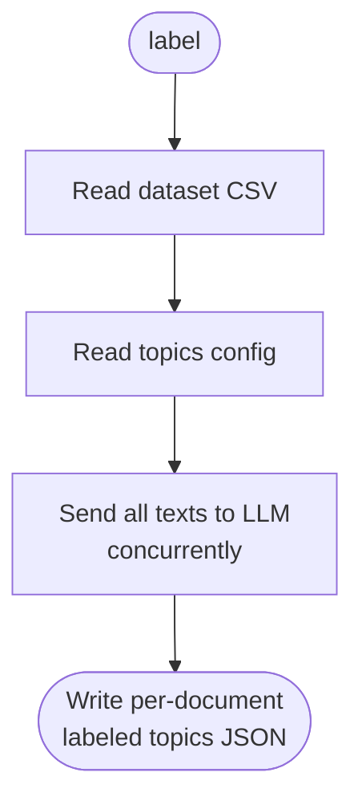

# Topic-builder

CLI tool for topic modeling backed by a language model.

**Requirements**: This project requires [uv](https://github.com/astral-sh/uv) 0.11+ and [docker](https://www.docker.com/).

## Table of contents

- [1. Setup](#1-setup)
  - [Local setup](#local-setup)
  - [LLM server setup](#llm-server-setup)
- [2. Usage](#2-usage)
  - [Screen a directory into a dataset](#-screen-a-directory-into-a-dataset)
  - [Discover new topics](#-discover-new-topics)
  - [Factorize existing topics](#-factorize-existing-topics)
  - [Structure topics into a hierarchy](#-structure-topics-into-a-hierarchy)
  - [Label text using topics](#️-label-text-using-topics)
  - [Display the knowledge graph](#️-display-the-knowledge-graph)
- [3. Contribute](#3-contribute)

## 1. Setup

### Local setup

Install the project and its dependencies in an isolated virtual environment

```shell
uv sync
```

### LLM server setup

This project necessitates a LLM server with openai-compatible API.
If necessary, you can set up a local `vllm` server with Docker Compose (see [`conf/docker/README.md`](conf/docker/README.md) f)

```sh
docker compose -f conf/docker/docker-compose.qwen3-4b-instruct-fp8.yml up -d
```

[Back to top](#topic-builder)

## 2. Usage

In all commands requiring a LLM server, set the flag `--llm-config-path` pointing to the appropriate LLM client config, eg if `docker-compose.qwen3-4b-instruct-fp8.yml` is running then use  `--llm-config-path conf/clients/vllm-qwen3-4b-it-fp8.yaml`.

### 📂 Screen a directory into a dataset

Recursively collect all `.txt` and `.md` files under a directory and write them to a CSV dataset with `id` (file path) and `content` (file text) columns. This CSV is the input format expected by `discover` and `label`.

<details>
<summary>Flow</summary>



</details><br>

**Command:**

```shell
uv run topicbuilder screen [OPTIONS]
```

| Option | Description |
|---|---|
| `--input-dir PATH` | Directory to scan recursively for `.txt` and `.md` files |
| `--output-path PATH` | Path where the output CSV will be written |

**Example:**

```shell
uv run topicbuilder screen \
  --input-dir data/sample/raw \
  --output-path data/sample/dataset.csv
```

**Output — dataset CSV** (`--output-path`):

```
id,content
docs/intro.md,"This document covers..."
docs/sub/guide.txt,"Step-by-step instructions..."
```

[Back to top](#topic-builder)

### 🔍 Discover new topics

Identify new topics across a dataset CSV and append them to an existing topics config.
All documents are processed concurrently.
**Note**: The topics config is appended to each LLM call, which can quickly consume the full window context if the config is large.

<details>
<summary>Flow</summary>



</details><br>

**Command:**

```shell
uv run topicbuilder discover [OPTIONS]
```

| Option | Description |
| --- | --- |
| `--dataset-path PATH` | Path to a CSV file with `id` and `content` columns |
| `--taxonomy-path PATH` | *(optional)* Path to the existing taxonomy JSON. If omitted, starts from an empty taxonomy |
| `--llm-config-path PATH` | Path to the LLM client config YAML |
| `--output-path PATH` | Path where the updated taxonomy JSON will be written |
| `--prompt-path PATH` | *(optional)* Path to the system prompt file *(default: `conf/prompts/discover.md`)* |
| `--chunk-max-words INT` | *(optional)* Max words per text chunk *(default: 500)* |

**Example:**

```shell
uv run topicbuilder discover \
  --dataset-path data/sample/dataset.csv \
  --llm-config-path conf/clients/vllm-qwen3-4b-it-fp8.yaml \
  --output-path data/sample/analysis/taxonomy.json
```

**Output — taxonomy JSON** (`--output-path`):

```json
{
  "topics": [
    {
      "id": "a1b2c3d4-e5f6-7890-abcd-ef1234567890",
      "name": "Short topic label",
      "description": "Concise, text-agnostic definition of the concept.",
      "parent": null,
      "level": 0,
      "validated": false
    }
  ]
}
```

[Back to top](#topic-builder)

### 🪛 Factorize existing topics

Merge near-duplicate topics. Only level-0 topics are considered; higher-level topics pass through unchanged. Topics with `"validated": true` are preserved verbatim — they cannot be merged away, and any child or parent references to a merged-away source are redirected to the surviving target.

The merge pipeline consists in 3 steps:
1. **Topic pre-clustering** — topics are chunked into clusters of topics using some heuristic.
2. **Candidate generation** — given a chunk and its list of topic names, the model proposes sub-groups of potentially duplicate names.
3. **Merge validation** — given the full name and description of each candidate group, the model decides the actual merge operations.

After applying the merges, the resulting taxonomy is automatically sanity-checked for structural violations: cycles in the parent hierarchy, duplicate topic names, dangling parent references, self-parents, and empty/whitespace-only fields. If any violation is detected it is printed to stderr, but the output files are still written so you can inspect or hand-edit the result.

<details>
<summary>Flow</summary>



</details><br>

**Command:**

```shell
uv run topicbuilder factorize [OPTIONS]
```

| Option | Description |
|---|---|
| `--taxonomy-path PATH` | Path to the taxonomy JSON to clean |
| `--llm-config-path PATH` | Path to the LLM client config YAML |
| `--output-path PATH` | Path where the cleaned taxonomy JSON will be written |
| `--report-path PATH` | Path where the change report JSON will be written |
| `--prompts-dir PATH` | *(optional)* Directory containing the factorize prompt files *(default: `conf/prompts/factorize`)* |
| `--chunk-size INT` | *(optional)* Max level-0 topics per merge-generation chunk *(default: 500)* |

**Example:**

```shell
uv run topicbuilder factorize \
  --taxonomy-path data/sample/analysis/taxonomy.json \
  --llm-config-path conf/clients/vllm-qwen3-4b-it-fp8.yaml \
  --output-path data/sample/analysis/taxonomy_factorized.json \
  --report-path data/sample/analysis/report_factorization.json
```

**Output — cleaned taxonomy JSON** (`--output-path`): same format as discover output.

**Output — change report JSON** (`--report-path`):

```json
{
  "merges": [
    {
      "target": "Surviving topic name",
      "sources": ["Duplicate A", "Duplicate B"]
    }
  ]
}
```

[Back to top](#topic-builder)

### 🌳 Structure topics into a hierarchy

Group parentless topics under new parent meta-topics. Topics with `"validated": true` are protected — they cannot be re-parented.

The structuring pipeline runs per level, from level 0 upward. Within each level, parentless topics are chunked and processed in two LLM steps per chunk:
1. **Topic pre-clustering** — topics are chunked into clusters of topics using some heuristic.
2. **Candidate generation** — given a chunk of topic names only, the model proposes parent names with candidate children.
3. **Parent validation** — given the full name and description of each candidate group, the model confirms the parent name, writes a description, and selects the final subset of children.

New parent topics are created at `level = children_level + 1`. Parents created at level 1 become candidates for grouping in the next iteration, allowing the hierarchy to grow upward until no further grouping is possible.

After applying all additions, the resulting taxonomy is sanity-checked for structural violations (same checks as factorize). Violations are printed to stderr; output files are always written.

<details>
<summary>Flow</summary>



</details><br>

**Command:**

```shell
uv run topicbuilder structure [OPTIONS]
```

| Option | Description |
|---|---|
| `--taxonomy-path PATH` | Path to the taxonomy JSON to structure |
| `--llm-config-path PATH` | Path to the LLM client config YAML |
| `--output-path PATH` | Path where the structured taxonomy JSON will be written |
| `--report-path PATH` | Path where the change report JSON will be written |
| `--prompts-dir PATH` | *(optional)* Directory containing the structure prompt files *(default: `conf/prompts/structure`)* |
| `--chunk-size INT` | *(optional)* Max parentless topics per parent-generation chunk *(default: 500)* |


**Example:**

```shell
uv run topicbuilder structure \
  --taxonomy-path data/sample/analysis/taxonomy_factorized.json \
  --llm-config-path conf/clients/vllm-qwen3-4b-it-fp8.yaml \
  --output-path data/sample/analysis/taxonomy_structured.json \
  --report-path data/sample/analysis/report_structuration.json
```

**Output — structured taxonomy JSON** (`--output-path`):

```json
{
  "topics": [
    {
      "id": "a1b2c3d4-e5f6-7890-abcd-ef1234567890",
      "name": "Child topic",
      "description": "Leaf concept definition.",
      "parent": "Parent meta-topic name",
      "level": 0,
      "validated": false
    },
    {
      "id": "b2c3d4e5-f6a7-8901-bcde-f12345678901",
      "name": "Parent meta-topic name",
      "description": "Broader concept grouping related children.",
      "parent": null,
      "level": 1,
      "validated": false
    }
  ]
}
```

**Output — change report JSON** (`--report-path`):

```json
{
  "parents_added": [
    {
      "parent": "New meta-topic name",
      "description": "Broader concept grouping related children.",
      "children": ["Child topic A", "Child topic B"]
    }
  ]
}
```

[Back to top](#topic-builder)

### 🏷️ Label text using topics

Label each document in a dataset CSV using a topics config. All documents are processed concurrently and results are keyed by document id.

<details>
<summary>Flow</summary>



</details><br>

**Command:**

```shell
uv run topicbuilder label [OPTIONS]
```

| Option | Description |
|---|---|
| `--dataset-path PATH` | Path to a CSV file with `id` and `content` columns |
| `--taxonomy-path PATH` | Path to the taxonomy JSON |
| `--llm-config-path PATH` | Path to the LLM client config YAML |
| `--output-path PATH` | Path where the labeled topics JSON will be written |
| `--prompt-path PATH` | *(optional)* Path to the system prompt file *(default: `conf/prompts/label.md`)* |
| `--chunk-max-words INT` | *(optional)* Max words per text chunk *(default: 500)* |
| `--taxonomy-chunk-size INT` | *(optional)* Max level-0 topics per taxonomy chunk *(default: 50)* |

**Example:**

```shell
uv run topicbuilder label \
  --dataset-path data/sample/dataset.csv \
  --taxonomy-path data/sample/analysis/taxonomy_structured.json \
  --llm-config-path conf/clients/vllm-qwen3-4b-it-fp8.yaml \
  --output-path data/sample/analysis/instances.json
```

**Output — labeled topics JSON** (`--output-path`):

```json
{
  "documents": [
    {
      "id": "docs/intro.md",
      "labels": [
        {
          "name": "Short topic label",
          "rationale": "1–3 sentence justification of why this topic is present in the text.",
          "extract": "Verbatim excerpt from the input text that best illustrates the topic."
        }
      ]
    }
  ]
}
```

[Back to top](#topic-builder)

### 🖥️ Display the knowledge graph

Launch an interactive browser-based viewer for a taxonomy JSON. The graph renders topics as nodes and parent–child relationships as directed edges.

Features:
- **Layout switcher** — Cose-Bilkent, Dagre, Breadthfirst, Concentric, Circle
- **Search** — highlight a node by name and dim all others
- **Filters** — narrow the graph by node type (topic / category) or validation status
- **Legend** — toggle a color legend overlay
- **Detail panel** — click or hover a node to inspect its metadata; toggle the panel open/closed
- **Stats bar** — live count of topics, categories, and validated nodes in the topbar
- **Reload** — re-read the taxonomy from disk without restarting the server
- **Label occurrences** — when `--labels-path` is provided, the detail panel shows per-topic rationale and extract from the labeled dataset

**Command:**

```shell
uv run topicbuilder display [OPTIONS]
```

| Option | Description |
|---|---|
| `--taxonomy-path PATH` | Path to the taxonomy JSON file to visualise *(required)* |
| `--labels-path PATH` | *(optional)* Path to a labeled-dataset JSON to show per-topic rationale and extracts in the detail panel |
| `--port INTEGER` | Port to listen on *(default: 8050)* |
| `--debug` | Run the Dash server in debug mode |

**Example:**

```shell
uv run topicbuilder display \
  --taxonomy-path data/sample/analysis/taxonomy_structured.json \
  --labels-path data/sample/analysis/instances.json \
  --port 8080
```

Then open `http://localhost:8080` in your browser.

[Back to top](#topic-builder)

## 3. Contribute

- Create a feature branch
- Install the project `uv sync` and pre-commits `pre-commit install`
- Create your changes by following the development rules at `.claude/rules/develop.md`
- Test your changes by following the testing rules at `.claude/rules/test.md`
- Open a MR and tag at least the owner of this repository.

[Back to top](#topic-builder)

### TODO

- check the readme is up-to-date
- run analysis
